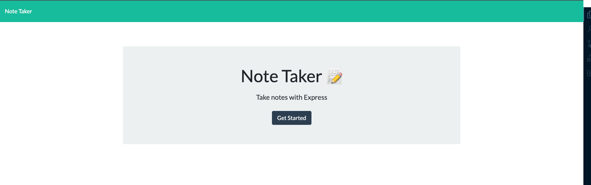
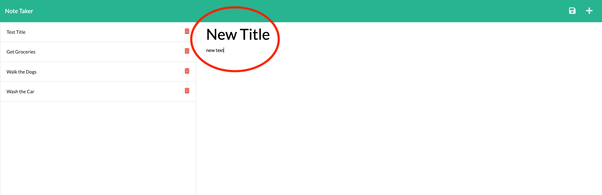
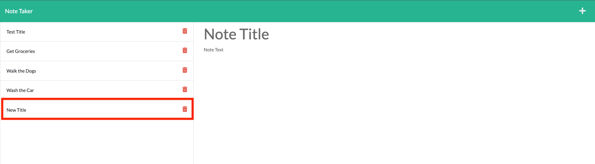

  # Note_Taker

  ## License: MIT  
  ### https://opensource.org/licenses/MIT

  # Description

  This is a very useful note-taker application. User will type in a note that they would like to keep track of, once the user enters in a title AND text, the save icon will appear in the top right corner of the page which allows the users input to be saved under the column where the user can keep track of their notes.
  
  # Usage

  md
  md
  md

  deployed link : 
  ## https://limitless-beyond-83497.herokuapp.com/

  # Contributors

  thanks to Ben White, we figured out how to get the server information to print to the notes page.

  # Questions

    Any questions please contact me via:
    Github: https://github.com/fredkamm
     OR
    Email: fred.kamm95@gmail.com

